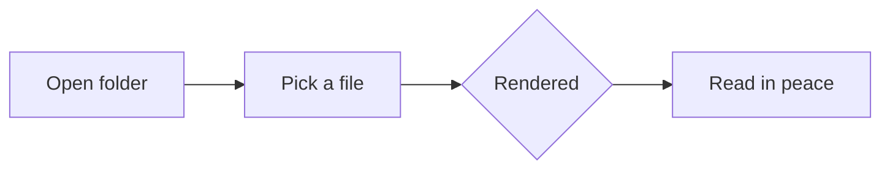

# Welcome to ZIMD

A calm, local place to read Markdown. This file exists so you can feel the
reading experience right away — open this `sample` folder from the sidebar.

> Typography is the craft of endowing human language with a durable visual form.
> — Robert Bringhurst

## Reading, considered

ZIMD keeps a comfortable measure, generous leading, and a single restrained
accent. Use the controls in the title bar to adjust **text size**, switch
between *sans* and *serif*, and toggle **light / dark**.

You can also use the keyboard:

- `⌘O` — open a folder
- `⌘B` — toggle the sidebar
- `⌘\` — toggle the contents panel
- `⌘ +` / `⌘ −` — adjust reading size

## Rich rendering

### Code

```rust
fn main() {
    let greeting = "Hello from ZIMD";
    println!("{greeting}");
}
```

```typescript
const measure = (chars: number): string => `${chars}ch`;
console.log(measure(66));
```

### Tables

| Feature            | Status | Notes                          |
| ------------------ | :----: | ------------------------------ |
| Sidebar file tree  |   ✓    | Folders first, then files      |
| Table of contents  |   ✓    | Scroll-synced, click to jump   |
| Syntax highlight   |   ✓    | Theme-aware palette            |
| Math (KaTeX)       |   ✓    | Inline and display             |
| Mermaid diagrams   |   ✓    | Lazily loaded                  |

### Task lists

- [x] Design the reading surface
- [x] Wire the Markdown pipeline
- [ ] Read something wonderful

### Math

Inline: the area of a circle is $A = \pi r^2$.

Display:

$$
\int_{-\infty}^{\infty} e^{-x^2}\,dx = \sqrt{\pi}
$$

### Diagrams



---

Designed & developed by **Zii**.
